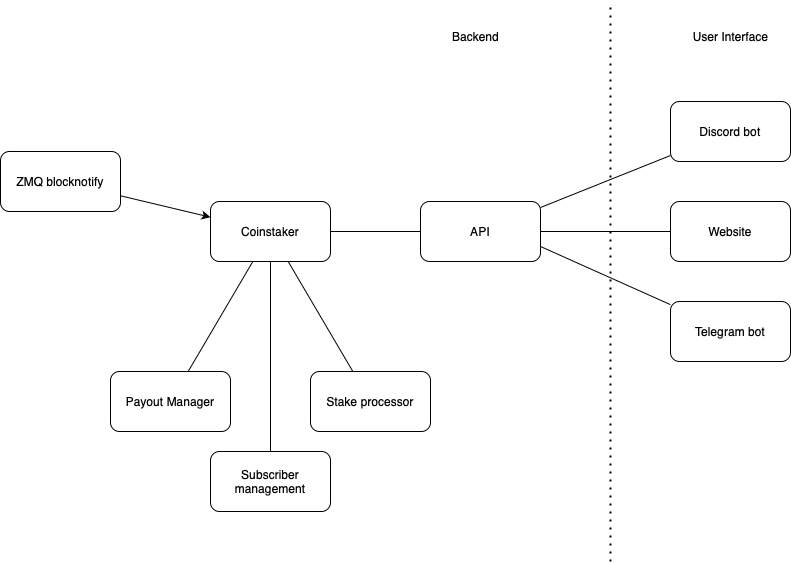

# Verus Staking Pool

This is the back-end part of a staking pool for the Verus Platform. It:

- manages subscribers to the pool
- tracks shares (how much each staker put in)
- handles payments to subscribers

Coinstaker (chainstaker) is at the center of the pool. It sits close to the Verus daemon to request updates regarding VerusIDs and block notifications. 

It runs a message queue and receives all kinds of messages:

- updates to subscribers (from UI)
- new block notification (from ZMQ)
- payment updates
- stake updates

A separate API runs alongside Coinstaker to allow for interfaces to connect to the pool. Using this API, new subscribers can be added to the pool and other information can be queried.

The API also pushes notifications:

- when a new subscriber joins
- when a subscriber leaves
- when a stake is found
- when a stake matures / is stale
- when a payment is done

Details regarding this API are still subject to many changes so documentation is still scarce.

## Subscriber management

In order for people to start staking in a staking pool, they must subscribe their staking resources to a pool. Using VerusID, the way to do this is to add a primary address to their VerusID. This primary address is owned by the staking pool and allows the pool to use the resources and hunt stakes.

Additionally, every individual pool can add certain conditions to which every new subscriber’s VerusID must adhere to:

- a delay lock time; how long it takes for a VerusID to be unlocked,
- whether a separate revoke and recover identity is required
- how many primary addresses a subscriber’s VerusID may hold
- a limit on the number of UTXOs a VerusID has
- (possibly more in the future)

## Stake processor

Every time a block is added to the (Verus/PBaaS) chain, a block notification is sent using ZMQ. It gets processed in the Coinstaker message queue and checks if it was staked by one of the pool’s subscribers. If it is, it needs to wait for maturity (150 blocks). 

When the block matures, a payout is calculated based on the work that was put in by every subscriber. Work is tracked in a local database and is based on the amount of eligible staking supply at every block height leading up to the stake.

## Payout manager

Once a subscriber’s (configurable) minimum payout threshold is reached, a payout is done. To prevent many smaller UTXOs, a payout manager keeps track of pending balances for every subscriber and pays out at a configurable period.

